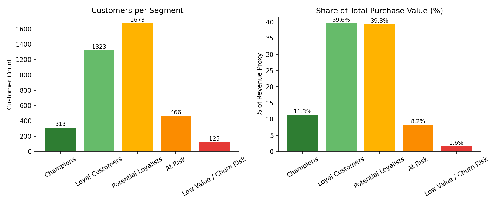

# 🛍️ Customer Shopping Behavior Analysis

An end-to-end data analytics project analyzing retail customer shopping behavior using **Python, PostgreSQL, SQL, and Power BI** — from data cleaning and feature engineering to SQL-based business analysis and an interactive dashboard.


---

## 📖 Table of Contents

- [Overview](#-overview)
- [Dataset](#-dataset)
- [Tech Stack](#️-tech-stack)
- [Project Workflow](#-project-workflow)
- [Project Steps](#-project-steps)
- [Key Business Questions & Results](#-key-business-questions--results)
- [Dashboard](#-dashboard)
- [Key Insights](#-key-insights)
- [RFM Customer Segmentation](#-rfm-customer-segmentation)
- [Business Recommendations](#-business-recommendations)
- [Project Deliverables & Structure](#-project-deliverables--structure)
- [How to Run](#-how-to-run)
- [Author](#-author)

---

## 📖 Overview

Retail businesses generate large volumes of transaction data, but raw data alone doesn't drive decisions — it needs to be cleaned, analyzed, and visualized. This project takes a **Customer Shopping Behavior dataset** through a full analytics pipeline: preprocessing and EDA in Python, structured business analysis in PostgreSQL via SQL, and an interactive Power BI dashboard for stakeholders to explore.

---

## 📂 Dataset

| Attribute | Details |
|---|---|
| Dataset Name | Customer Shopping Behavior Dataset |
| Domain | Retail Analytics |
| Records | 3,900 |
| Columns | 18 |
| Format | CSV |

**Features:** Customer demographics (age, gender, location), purchase history (item, category, amount), product attributes (size, color, season), review ratings, subscription status, payment & shipping method, discount/promo usage, purchase frequency, and previous purchase count.

---

## 🛠️ Tech Stack

| Tool | Purpose |
|---|---|
| Python / Pandas | Data loading, cleaning, EDA, feature engineering |
| PostgreSQL | Storage and management of processed data |
| SQL (pgAdmin) | Business analysis and querying |
| SQLAlchemy | Python ↔ PostgreSQL connection |
| Power BI | Interactive dashboard and visualization |
| Jupyter Notebook | Development and documentation |

---

## 🔄 Project Workflow

```
Raw Dataset → Data Loading → Cleaning & Preprocessing → EDA
     → Feature Engineering → PostgreSQL → SQL Business Analysis
     → RFM Customer Segmentation → Power BI Dashboard
     → Business Insights & Recommendations
```

---

## 📌 Project Steps

### 1. Data Preprocessing
- Loaded data with Pandas; inspected structure with `df.info()` and `df.describe()`.
- Checked for missing values and duplicates.
- Only `Review Rating` had nulls (37 of 3,900 rows).

### 2. Feature Engineering
- Filled missing `Review Rating` values using the **median rating per product category**.
- Standardized all column names to `snake_case`.
- Created an `age_group` column (Young Adult / Adult / Middle-aged / Senior) via quartile binning.
- Converted `frequency_of_purchases` (e.g. "Weekly", "Annually") into a numeric `purchase_frequency_days` column.
- Dropped `promo_code_used` after confirming it was 100% identical to `discount_applied`.

### 3. Database Integration
- Connected Python to PostgreSQL with SQLAlchemy (`psycopg2` driver).
- Loaded the cleaned DataFrame into a `customer` table using `to_sql()`.
- Verified the import in pgAdmin before running analysis.

### 4. SQL Business Analysis
Ten structured queries answering real business questions — see results below.

### 5. RFM Customer Segmentation
Classified all customers into value tiers (Champions, Loyal, Potential Loyalists, At Risk, Low Value) using Recency, Frequency, and Monetary scoring — see [full section below](#-rfm-customer-segmentation).

### 6. Dashboard Development
Built an interactive Power BI dashboard with KPI cards, category/age breakdowns, and slicers.

---

## 📊 Key Business Questions & Results

| # | Question | Result |
|---|---|---|
| 1 | Revenue by gender | Male: **$157,890** · Female: **$75,191** |
| 2 | High-spending discount users | Multiple customers spent above the $59.76 average purchase amount while using a discount |
| 3 | Top 5 products by review rating | Gloves (3.86), Sandals (3.84), Boots (3.82), Hat (3.80), Skirt (3.78) |
| 4 | Standard vs Express shipping spend | Standard: $58.46 avg · Express: $60.48 avg |
| 5 | Subscribers vs non-subscribers | Non-subscribers: 2,847 customers, $170,436 total revenue · Subscribers: 1,053 customers, $62,645 total revenue |
| 6 | Products most dependent on discounts | Hat (50%), Sneakers (49%), Coat (49%), Sweater (48%), Pants (47%) |
| 7 | Customer segmentation (New/Returning/Loyal) | Loyal: 3,116 · Returning: 701 · New: 83 |
| 8 | Top 3 products per category | e.g. Clothing → Blouse, Pants, Shirt; Footwear → Sandals, Shoes, Sneakers |
| 9 | Do repeat buyers (>5 purchases) subscribe more? | No — 2,518 non-subscribers vs 958 subscribers among repeat buyers |
| 10 | Revenue by age group | Young Adult: $62,143 · Middle-aged: $59,197 · Adult: $55,978 · Senior: $55,763 |

Full query text is available in [`queriessss.sql`](queriessss.sql).

---

## 📈 Dashboard

The Power BI dashboard includes:
- KPI cards — total customers, average purchase amount, average review rating
- Revenue & sales breakdown by category and by age group
- Subscription status donut chart
- Interactive slicers: subscription status, gender, category, shipping type

*(Full dashboard walkthrough and screenshots are included in the [Project Report](Customer_analysis_finall_report.pdf), with presentation slides in [Customer-Shopping-Behavior-Analysis.pdf](Customer-Shopping-Behavior-Analysis.pdf).)*

---

## 📊 Key Insights

- **Clothing** generated the highest revenue among all product categories.
- **Young Adult** customers contributed the highest overall revenue ($62,143).
- The majority (73%) of customers were **non-subscribers** — a clear growth opportunity.
- **Express shipping** customers spent slightly more on average than Standard shipping customers.
- **Loyal customers** (3,116) made up the largest segment by far, ahead of Returning (701) and New (83).
- **RFM segmentation** shows Champions + Loyal Customers (~42% of customers) drive over 50% of purchase value, while At Risk + Low Value segments (~15% of customers) contribute under 10%.

---

## 🎯 RFM Customer Segmentation

Extended the analysis with an **RFM (Recency, Frequency, Monetary)** segmentation to classify all 3,900 customers into actionable value tiers — going beyond descriptive EDA into behavior-based customer scoring.

> **Note on Recency:** this dataset has no transaction date/timestamp, so a literal "days since last purchase" Recency could not be computed. `Frequency of Purchases` (e.g. "Weekly", "Annually") was used as a documented **recency proxy**, mapped to an estimated typical gap between purchases. Frequency and Monetary use the actual `previous_purchases` and `purchase_amount` fields.

**Segments:**

| Segment | Customers | % of Customers | % of Revenue | Avg. Purchase |
|---|---|---|---|---|
| Loyal Customers | 1,323 | 33.9% | 39.6% | $69.76 |
| Potential Loyalists | 1,673 | 42.9% | 39.3% | $54.71 |
| Champions | 313 | 8.0% | 11.3% | $83.97 |
| At Risk | 466 | 11.9% | 8.2% | $41.04 |
| Low Value / Churn Risk | 125 | 3.2% | 1.6% | $30.75 |



**Key finding:** Champions and Loyal Customers together are ~42% of the customer base but drive over **50% of total purchase value** — while the bottom two segments (At Risk + Low Value) are 15% of customers but under 10% of revenue. This is a clear signal for where retention and marketing spend should be prioritized.

Implementation available in both [`rfm/rfm_segmentation.py`](rfm/rfm_segmentation.py) (pandas) and [`rfm/rfm_segmentation.sql`](rfm/rfm_segmentation.sql) (PostgreSQL, using `NTILE()` window functions).

---

## 💡 Business Recommendations

- Introduce targeted subscription offers to convert non-subscribers.
- Focus marketing spend on top-performing categories (Clothing, Accessories).
- Reward loyal customers with exclusive discounts/loyalty programs.
- Promote highly-rated products (Gloves, Sandals, Boots) to drive engagement.
- Use the New/Returning/Loyal segmentation for personalized campaigns.
- Prioritize retention spend on **Champions and At Risk** segments identified via RFM — Champions to protect high-value revenue, At Risk to prevent churn before it happens.

---
## 📄 Project Deliverables & Structure

```
Customer_Behavior_Analysis/
│
├── rfm/
│   ├── rfm_segmentation.py
│   ├── rfm_segmentation.sql
│   ├── rfm_segments.csv
│   ├── rfm_segment_summary.csv
│   └── rfm_segments_chart.png
├── customer_shopping_behavior.csv           # Raw dataset
├── customers_retail_behavior.ipynb          # Data cleaning, EDA, feature engineering
├── queriessss.sql                            # SQL business analysis queries
├── Customer_Behavior_dashboard.pbix         # Power BI dashboard
├── Customer_analysis_finall_report.pdf      # Final written report
├── Customer-Shopping-Behavior-Analysis.pdf  # Presentation slides
├── requirements.txt                         # Python dependencies
└── README.md
```

---

## 🚀 How to Run

1. **Clone the repository**
```bash
   git clone https://github.com/pes2ug23cs190/Customer_Behavior_Analysis.git
   cd Customer_Behavior_Analysis
```

2. **Install dependencies**
```bash
   pip install -r requirements.txt
   # or individually:
   pip install pandas sqlalchemy psycopg2-binary
```

3. **Set up PostgreSQL**
   - Create a database (e.g. `customer_behavior`).
   - Update the connection details (`username`, `password`, `host`, `port`, `database`) in the notebook.

4. **Run the notebook**
   - Open `customers_retail_behavior.ipynb` in Jupyter.
   - Run all cells to clean the data and load it into PostgreSQL (`to_sql()`).

5. **Run the SQL analysis**
   - Open `queriessss.sql` in pgAdmin (or your SQL client of choice) and execute against the `customer` table.

6. **Explore the dashboard**
   - Open `Customer_Behavior_dashboard.pbix` in Power BI Desktop.

   
## 👨‍💻 Author

**Favaz Ahmed**
B.Tech Computer Science & Engineering, PES University, Bengaluru

📫 Connect: *[add your LinkedIn / portfolio / email here]*

---

## 📜 License

This project is open-sourced for learning and portfolio purposes. Feel free to fork and adapt — attribution appreciated.

If you found this project helpful, consider giving it a ⭐.
